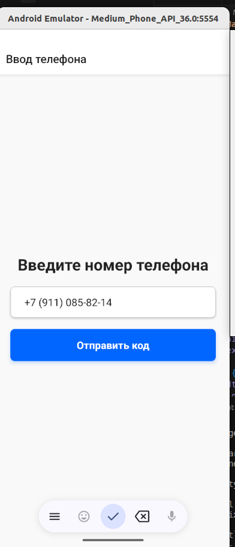
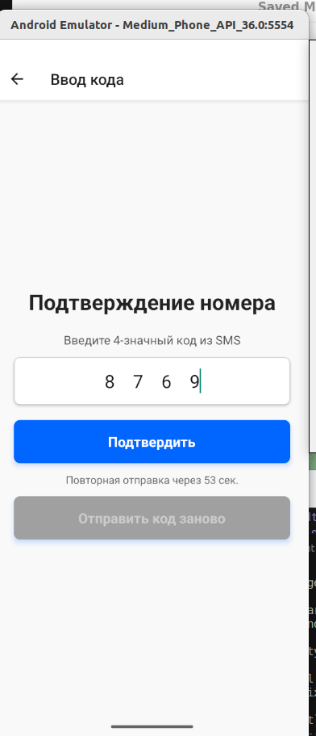
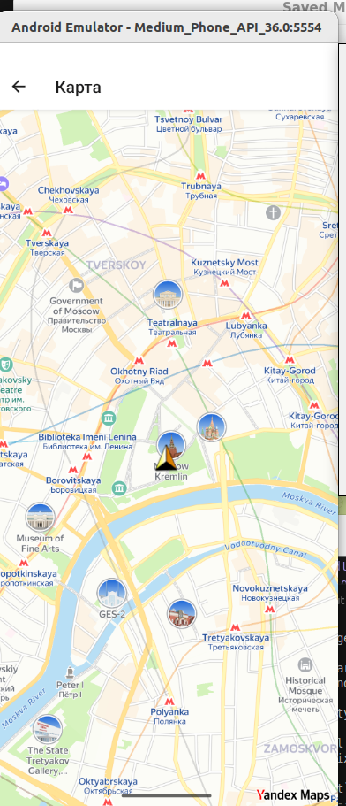

# Map App

A React Native app that simulates SMS-based phone verification and show the users location on the map:
- Phone number input
- Code verification
- Map screen

## How to Run the Project

1. Clone the repository:
   ```bash
   git clone https://github.com/DmitryMustk/MapApp.git
   cd MapApp
   ```

2. Install dependencies:
   ```bash
   npm install
   ```

3. Run the app:
   - For iOS:
     ```bash
     npx pod-install
     npx react-native run-ios
     ```
   - For Android:
     ```bash
     npx react-native run-android
     ```

---

##  Used Libraries

| Library                            | Purpose                                                                 |
|----------------------------------|-------------------------------------------------------------------------|
| `react-native-yamap-plus`         | Display Yandex Maps with support for markers            |
| `react-native-reanimated`         | Animation and transition support                                       |
| `react-native-safe-area-context`  | Support for device safe areas                                          |
| `react-native-masked-text`         | Input mask for phone number formatting                                 |
| `react-native-animatable`          | Button animations on press                                             |
| `react-native-geolocation-service`| Getting user geolocation               |

---

## Short Description

The app simulates SMS verification flow:
1. The user enters a phone number (with masking for `+7` format).
2. A 4-digit code is simulated and shown in an alert.
3. The user enters the code. If it matches, the app navigates to a Map screen.
4. Buttons are animated for better UX.
5. Resending code is limited with a countdown timer.

---

## 🖼️ Screenshots


### Phone Input Screen


### Code Input Screen


### Map Screen


---

## Demo


---
